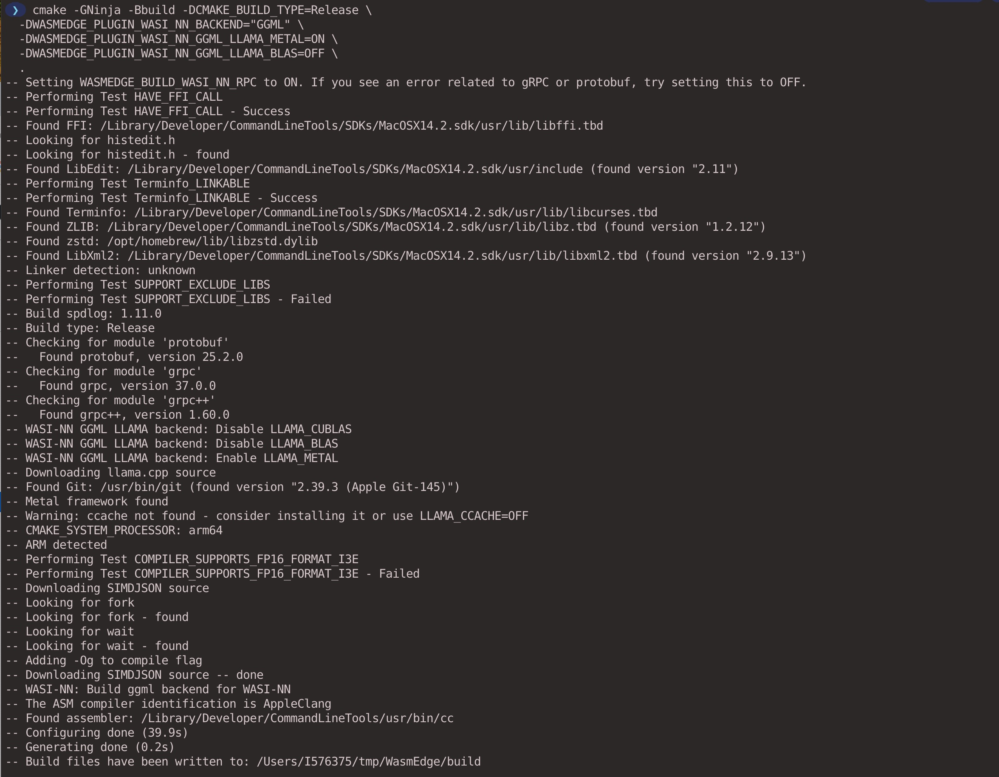
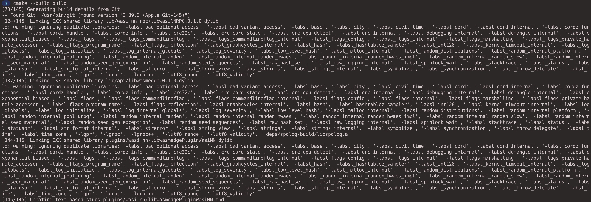
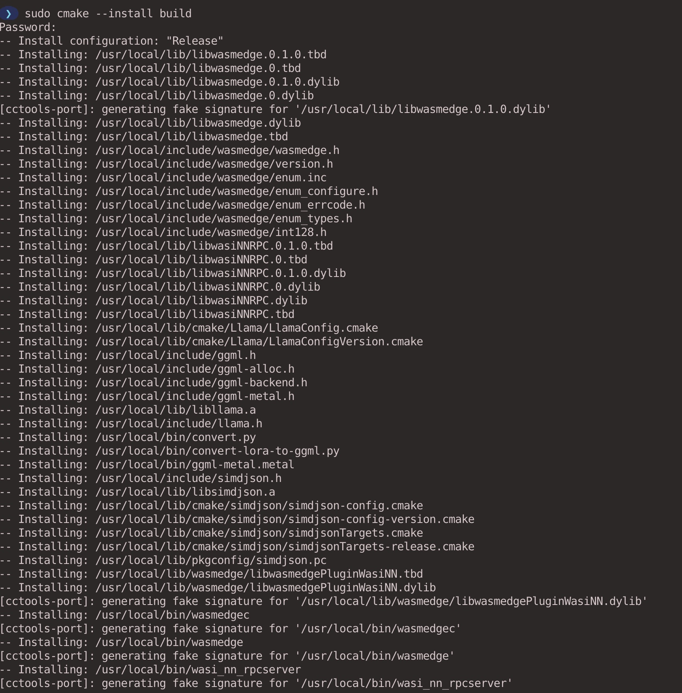
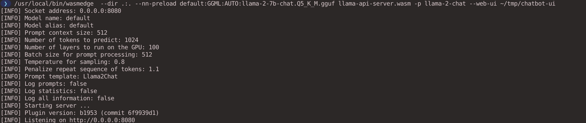
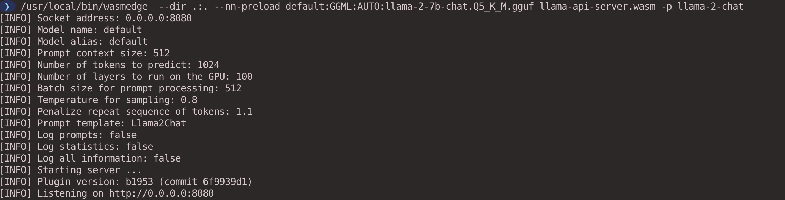
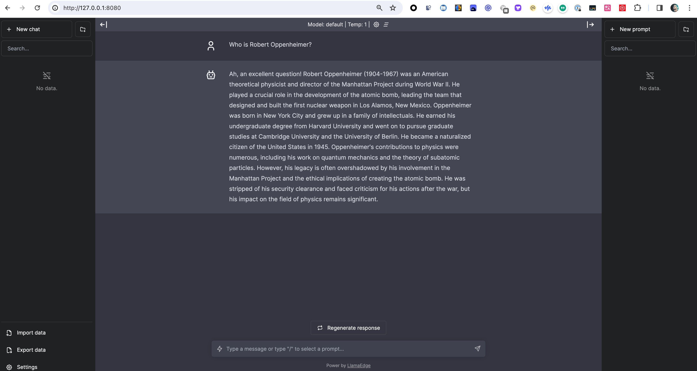
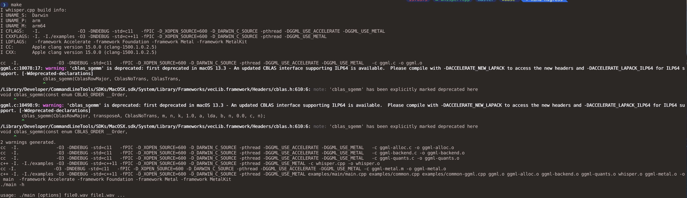
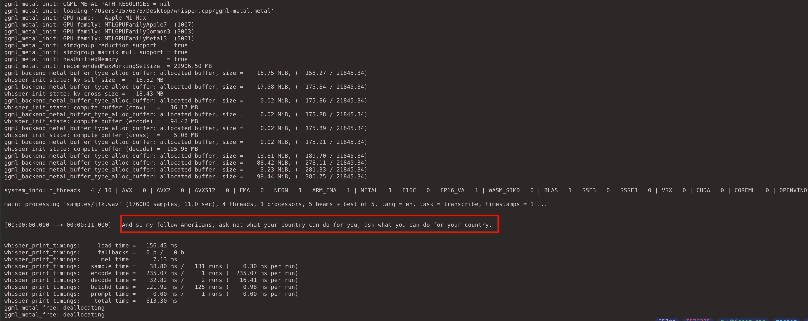

# LFX-Mentorship-WasmEdge-2024-01-Pre-test 

Applied Issue: [Integrate whisper.cpp as a new WASI-NN backend](https://github.com/WasmEdge/WasmEdge/issues/3170)

* [1 Environment](#1-environment)
* [2 Build WasmEdge with WASI-NN llama.cpp Backend](#2-build-wasmedge-with-wasi-nn-llamacpp-backend)
* [3 Create an OpenAI compatible API server for your LLM](#3-create-an-openai-compatible-api-server-for-your-llm)
  * [3.1 Get the llama-api-server.wasm app](#31-get-the-llama-api-serverwasm-app)
  * [3.2 Download the model](#32-download-the-model)
  * [3.3 Run the API server via curl](#33-run-the-api-server-via-curl)
  * [3.4 Test the API server via terminal](#34-test-the-api-server-via-terminal)
  * [3.4 Add a web UI](#34-add-a-web-ui)
* [4 whisper.cpp](#4-whispercpp)
  * [4.1 Use main example](#41-use-main-example)
  * [4.2 Real-time audio input example](#42-real-time-audio-input-example)

## 1 Environment

```bash
uname -a
Darwin WXQ6ML73V1 23.2.0 Darwin Kernel Version 23.2.0: Wed Nov 15 21:53:18 PST 2023; root:xnu-10002.61.3~2/RELEASE_ARM64_T6000 arm64
```

## 2 Build WasmEdge with WASI-NN llama.cpp Backend

Install dependencies.

```bash
brew install cmake
brew install grpc
brew install llvm
```

build and install WasmEdge from source directly on the macOS arm64 platform.

```bash
git clone https://github.com/WasmEdge/WasmEdge.git -b hydai/0.13.5_ggml_lts 
cd WasmEdge

# Apple Silicon Model
export LLVM_DIR=/opt/homebrew/opt/llvm/lib/cmake
cmake -GNinja -Bbuild -DCMAKE_BUILD_TYPE=Release \
  -DWASMEDGE_PLUGIN_WASI_NN_BACKEND="GGML" \
  -DWASMEDGE_PLUGIN_WASI_NN_GGML_LLAMA_METAL=ON \
  -DWASMEDGE_PLUGIN_WASI_NN_GGML_LLAMA_BLAS=OFF \
  .
```



```bash
cmake --build build
```




```bash
cmake --install build
```



## 3 Create an OpenAI compatible API server for your LLM

### 3.1 Get the llama-api-server.wasm app

```bash
curl -LO https://github.com/second-state/LlamaEdge/releases/latest/download/llama-api-server.wasm
```

### 3.2 Download the model

```bash
curl -LO https://huggingface.co/second-state/Llama-2-7B-Chat-GGUF/resolve/main/Llama-2-7b-chat-hf-Q5_K_M.gguf
```

### 3.3 Run the API server via curl

```bash
wasmedge --dir .:. --nn-preload default:GGML:AUTO:llama-2-7b-chat.Q5_K_M.gguf llama-api-server.wasm -p llama-2-chat
```




### 3.4 Test the API server via terminal

List models.

```bash
curl -X POST http://localhost:8080/v1/models -H 'accept:application/json' -s | jq

# Response
{
  "object": "list",
  "data": [
    {
      "id": "default:llama-2-chat",
      "created": 1706836242,
      "object": "model",
      "owned_by": "Not specified"
    }
  ]
}
```

Ask a question using OpenAI's JSON message format.

```bash
curl -X POST http://localhost:8080/v1/chat/completions \
-H 'accept:application/json' -H 'Content-Type: application/json' \
-d '{
  "messages": [
    {
      "role": "system",
      "content": "You are a helpful assistant."
    },
    {
      "role": "user",
      "content": "Who is Robert Oppenheimer?"
    }
  ],
  "model": "llama-2-chat"
}' -s | jq

# Response
{
  "id": "d74ff381-6830-43dd-8f46-9f9815b3f62d",
  "object": "chat.completion",
  "created": 1706837616,
  "model": "llama-2-chat",
  "choices": [
    {
      "index": 0,
      "message": {
        "role": "assistant",
        "content": "Ah, an excellent question! Robert Oppenheimer (1904-1967) was a renowned American physicist and science administrator who played a crucial role in the development of the atomic bomb during World War II. He is often referred to as the \"Father of the Atomic Bomb.\"\nOppenheimer was born in New York City and grew up in a family that valued education and intellectual pursuits. He showed an early interest in science and mathematics, and"
      },
      "finish_reason": "stop"
    }
  ],
  "usage": {
    "prompt_tokens": 34,
    "completion_tokens": 103,
    "total_tokens": 137
  }
}
```

The following command sends a prompt to the API server and gets the completion:

```bash
 curl -X POST http://localhost:8080/v1/completions \
    -H 'accept:application/json' \
    -H 'Content-Type: application/json' \
    -d '{"prompt":["Long long ago, "], "model":"tinyllama"}' -s | jq
    
# Response
{
  "id": "e705172e-cf83-4c87-b331-074fd7136ace",
  "choices": [
    {
      "finish_reason": "stop",
      "index": 0,
      "logprobs": null,
      "text": "in a far-off land, there was an emperor who ruled over his people with great wisdom and kindness. He was loved by all, and he knew that his people were the key to the prosperity of his kingdom. So he decided to hold a great contest, to find the most talented and capable person in his empire.\nThe contest was announced throughout the land, and people from far and wide came to the capital city to compete. The emperor set up a special arena"
    }
  ],
  "created": 1706837693,
  "model": "tinyllama",
  "object": "text_completion",
  "usage": {
    "prompt_tokens": 3,
    "completion_tokens": 84,
    "total_tokens": 87
  }
}

```

### 3.4 Add a web UI

Download front-end Web UI and extract it.

```bash
curl -LO https://github.com/second-state/chatbot-ui/releases/latest/download/chatbot-ui.tar.gz
tar xzf chatbot-ui.tar.gz
```

Use the same command line to create the API server.

```bash
wasmedge --dir .:. --nn-preload default:GGML:AUTO:llama-2-7b-chat.Q5_K_M.gguf llama-api-server.wasm -p llama-2-chat
```



Open http://127.0.0.1:8080 from the browser.



## 4 whisper.cpp

First clone the repository:

```bash
git clone https://github.com/ggerganov/whisper.cpp.git
```

### 4.1 Use main example

Download ggml model base.en:

```bash
bash ./models/download-ggml-model.sh base.en
Now build the main example and transcribe an audio file like this:
```

Build the main example:

```
make
```



Convert audio to text.

```bash
./main -m models/ggml-base.en.bin -f samples/jfk.wav
```



### 4.2 Real-time audio input example

This is a naive example of performing real-time inference on audio from your microphone. 

```bash
make stream
./stream -m ./models/ggml-base.en.bin -t 8 --step 500 --length 5000
```

https://github.com/cr7258/LFX-Mentorship-WasmEdge-2024-01-Pre-test/assets/40051120/0799e6b9-d5bf-410a-b368-30a005fd34f8

[Audio: Running WasmEdge Runtime as Dapr sidecar services](https://www.youtube.com/watch?v=t_sQP6Qpf7U)

